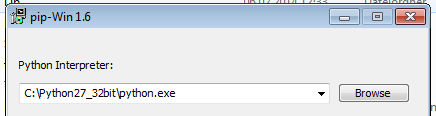
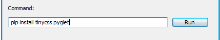

## Installation instructions from python source under Windows

This section is meant for developers or people who wish to change the functionality of the KommHELP talkshow application. A normal user should not need to read this section, please refer instead to the [INSTALLATION](../README.md#INSTALLATION) section.

See the section "other operating systems" at the bottom if you're not on Windows.

### Step 1: Install Python

* Download python 2.7.6 for 32 bit from [http://www.python.org/download](http://www.python.org/download)
it is important that the python version is at least 2.7, but not version 3.something. It is also important that the python version is for 32 bit systems, even if you have a 64 bit computer. So for Windows it's [Python 2.7.6 Windows Installer](http://www.python.org/ftp/python/2.7.6/python-2.7.6.msi)
* Install Python to a place you can find, for example `C:\Python27_32bit` Ideally the path should contain no spaces as that could create problems.

For the rest of this document I will assume you installed python to `C:\Python27_32bit`. If that is not the case, please adapt the paths below to match you installation path.


### Step 2A: install dependencies via simple script:

run `python installDependencies.py` in a terminal, or double-click the `installDependencies.bat` file.

If this worked, you can proceed to step 3. Otherwise, refer to the manual instructions in step 2A.

### Step 2B: Install "pip" package manager, and with pip install the python dependencies "tinycss" and "pyglet" [pip]

* download PIP for windows: [https://sites.google.com/site/pydatalog/python/pip-for-windows](https://sites.google.com/site/pydatalog/python/pip-for-windows)
* open the downloaded file, it might open a few command line windows and ask you to press a key - just press enter and wait for it to download what's necessary. Point it to your python executable (for example `C:\Python27_32bit\python.exe`):



Next, enter `pip install tinycss pyglet` into the second text field, and press `Run`:



### Step 3: Configure python on your system

Open a command line and enter: `python`
You should get something like this:

```
Python 2.7.6 (default, Nov 10 2013, 19:24:18) [MSC v.1500 32 bit (Intel)] on win32
Type "help", "copyright", "credits" or "license" for more information.
```

type `exit()` to get out of the Python shell.

#### if the above does not work or if you get the wrong python version:

The python is not available on your system path and you need to add it. Open system environment variables, find the entry for "Path" and add the directory of your python installation, and the `Scripts` subfolder to the beginning, separated by `;` and followed by a `;` sign:

```
C:\Python27_32bit;C:\Python27_32bit\Scripts;someotherpaths
```

If you get the wrong python version, change the Path variable so that it points to the correct installation directory instead. Please be careful during this step and ensure all paths are correctly separated with a `;` symbol.
After you added system variables, close your command line, and re-open it again (so it refreshes the Path variable)

### Step 4: Download and install VLC

Get VLC from [this direct link](https://get.videolan.org/vlc/2.1.3/win32/vlc-2.1.3-win32.exe) or choose another version from [https://www.videolan.org/](https://www.videolan.org/). Please make sure it's 32 bit.

### Step 5: Confirm you can start talkshow

Double-click on the talkshow.py file, or, if that does not work, from a terminal, enter:

```
python path_to_talkshow_folder\talkshow.py
```
or
```
C:\Python27_32bit\python.exe path_to_talkshow_folder\talkshow.py
```

### How to distribute kommHelp talkshow as a windows binary: Compile python sources to .exe executable

Download and install **pywin32** from this [direct link](http://sourceforge.net/projects/pywin32/files/pywin32/Build%20218/pywin32-218.win32-py2.7.exe/download) (if it does not work, find the version you need from here: [http://sourceforge.net/projects/pywin32/files/](http://sourceforge.net/projects/pywin32/files/). Pywin32 is needed to use pyinstaller.

Download **UPX** from [http://upx.sourceforge.net/](http://upx.sourceforge.net/). Unzip it and copy the executable to the folder containing talkshow.py. This adds compression to the compiled files. 

Install **pyinstaller** with pip: `pip install pyinstaller` (see [Step 2 for how to get pip on Windows](#pip)).

Check that `pyinstaller` on the command line works. If not, you need to add `C:\Python27_32bit\Scripts` to your environment variables.

Change directory to the folder containing the talkshow.py file: `cd your\path\to\the\directory\with\talkshow`
Then execute the pyinstaller command with the following arguments:

```
pyinstaller talkshow_noVLC.spec
```

if you have the libvlc.dll, libvlccore.dll and the vlc plugins directory in the same directory than the talkshow.py file you can also use the talkshow_full.spec file to include VLC in the windows binary. This assumes you have the above DLL files and a folder "plugins" from VLC available in the talkshow directory. You can copy them from the installation directoy of your VLC

This will generate a `talkshow.exe` file under `dist\talkshow` containing all the needed dependencies that you can distribute. You need to provide your own `content` folder alongside. 


### Other Operating Systems 

If you have Python 2.7, download [pip](http://www.pip-installer.org/en/latest/installing.html) and then do

```
pip install -r requirements.txt
```

if you have another version of python, install 32 bit Python 2.7, and then get Virtualenv from [here](http://www.verious.com/code/CharleneJiang/virtualenv-burrito/), and use it to make a python virtual environment for this version of python. Then, once in that shell, execute the above pip command (virtualenv comes bundled with pip).

Then you need to install [VLC](https://www.videolan.org/vlc/) if you don't have it already. Please see the sections above for more details on dependencies. 


